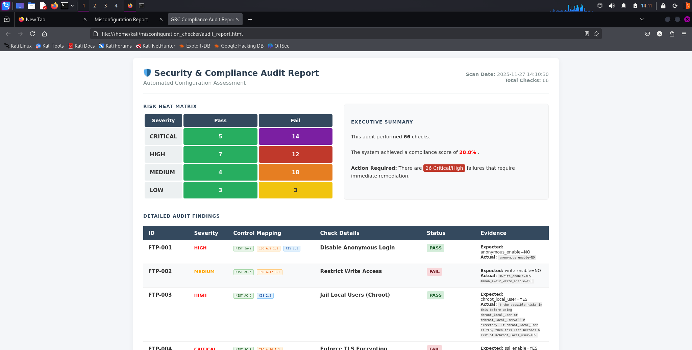
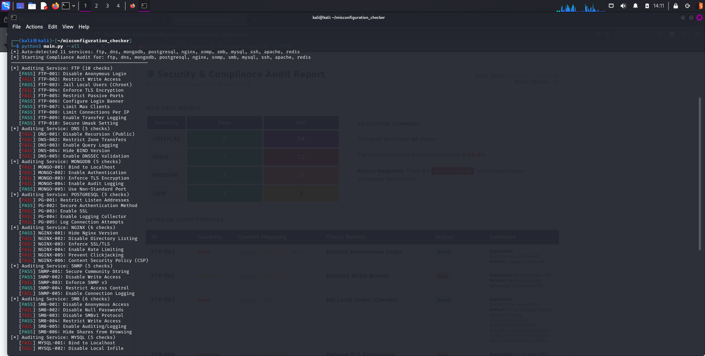

# 🛡️ GRC Compliance & Misconfiguration Scanner


## 📋 Overview

The **GRC Compliance & Misconfiguration Scanner** is a modular **Compliance-as-Code** framework designed to bridge the gap between DevOps and GRC. It automates the validation of Linux server security postures by mapping system configurations directly to industry standards:
* **NIST 800-53**
* **CIS Benchmarks**
* **ISO 27001**

By decoupling validation logic (Python) from security policies (YAML), this tool allows GRC teams to define audit criteria without needing to modify the core codebase.

---

## 📸 Screenshots

### 1. Executive HTML Dashboard
The tool generates a professional, audit-ready HTML report for stakeholders.

*(Note: If image does not load, run the tool to generate `audit_report.html`)*

### 2. Terminal Execution
Real-time feedback during the scanning process.


---

## ✨ Key Features

* **Policy-to-Control Mapping:** Every check is explicitly tagged with GRC controls (e.g., `NIST AC-6`, `CIS 5.2`) for easier audit tracking.
* **Service-Agnostic Engine:** Modular architecture supports checking configurations for **SSH, NGINX, MySQL, FTP, Redis**, and more.
* **YAML-Based Configuration:** Rules are defined in simple YAML files, making it easy to add new checks (Low-Code/No-Code approach for policy makers).
* **Automated Reporting:** Uses Jinja2 templating to produce high-quality HTML deliverables.

---

## 🏗️ Architecture

The system utilizes a **Rule Engine** pattern to separate business logic from policy definitions.

```mermaid
graph LR
    A[YAML Configs] -->|Rules & Standards| B(Audit Engine)
    B -->|Execute System Commands| C{Host System}
    C -->|Return Shell Output| B
    B -->|Process Compliance Data| D[Jinja2 Reporter]
    D -->|Generate| E[HTML Audit Report]
